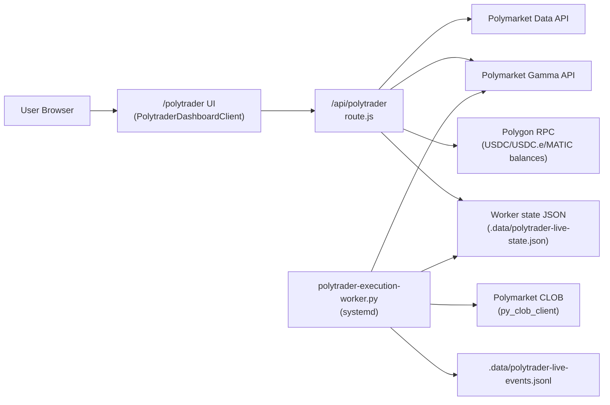

# PolyTrader Handoff (Technical)

Last updated: 2026-03-09

## 1) What this system is
PolyTrader is a standalone Next.js app that provides:
- A terminal-style trading dashboard at `/polytrader`
- A snapshot API at `/api/polytrader`
- A live execution worker that can place Polymarket CLOB orders (when allowed)

The app supports two runtime modes:
- `paper`: deterministic 60-day backtest simulation (starting equity `$1000`)
- `live`: real Polymarket/Gamma/Polygon reads + optional live order submission

## 2) Current status
- Repo: `https://github.com/komalamee/polytrader`
- Default branch: `main`
- Production URL: `https://hive.komalamin.com/polytrader`
- As of `2026-03-09`: live order placement is blocked by Polymarket geoblock from current server region.
- Exact blocker string seen by worker:
  - `Trading restricted in your region ... /geoblock`

The API surfaces this as:
- `execution.status = "monitor_only"`
- `execution.reason = "Polymarket blocked order placement for this server region (geoblocked)."`

## 3) Architecture



### Runtime units (VPS)
- `komalamin-next.service`
  - serves Next app on `127.0.0.1:4042`
- `polytrader-execution.service`
  - runs `scripts/polytrader-execution-worker.py`
- `hq/server.js` proxies:
  - `/polytrader`, `/api/polytrader` -> `komalamin-next` (port `4042`)

## 4) Code map (where to change what)
- UI page shell: `app/polytrader/page.jsx`
- Main dashboard client: `app/polytrader/PolytraderDashboardClient.jsx`
- Dashboard styles: `app/polytrader/polytrader.module.css`
- Data + execution status API: `app/api/polytrader/route.js`
- Live execution engine: `scripts/polytrader-execution-worker.py`
- Next standalone packer: `scripts/prepare-standalone.mjs`

## 5) Snapshot API contract
`GET /api/polytrader?mode=paper|live`

Top-level fields returned:
- `mode`, `asOf`
- `walletAddress`, `profileAddress`
- `risk` (`maxTradeUsd`, `maxDailyLossUsd`, `killSwitch`)
- `stats` (equity, pnl, trades, balances)
- `signals` (market, side, edge, confidence)
- `executionLog` (fills/activity)
- `equity` (timestamp/value points)
- `tradeMarkers` (paper/backtest markers)
- `backtest` (60-day summary)
- `calcPanels` (math panels shown on left rail)
- `diagnostics` (warnings/counts/latency)
- `account` (label + addresses)
- `execution` (live readiness and gating reasons)

## 6) Trading math (implemented)
These formulas are displayed in UI and used as guidance:

1. Bayes update
- `P(H|D) = P(D|H) * P(H) / P(D)`

2. Sequential Bayes
- `P(H|D1...Dt) ∝ P(H) * Π P(Dk|H)`
- stable form: `log P(H|D) = log P(H) + Σ log P(Dk|H) - log Z`

3. Expected value
- `EV = p_hat - p`

4. LMSR display
- `p_i(q) = exp(q_i / b) / Σ exp(q_j / b)`
- cost: `C(q) = b * ln(Σ exp(q_i / b))`

5. Kelly guidance
- `f* = (p*(1+b)-1)/b`
- enforcement in UI copy: never full Kelly on short-horizon markets

### Current signal heuristic (live + worker)
- Uses market probability distance from 0.5 + spread + liquidity-driven confidence
- Returns top 12 opportunities by `|edge|`
- This is a pragmatic heuristic, not a full calibrated model

## 7) Live execution gating (must all pass)
`execution.canSubmitLiveOrders` requires:
- `POLYTRADER_EXECUTION_ENGINE_ENABLED=true`
- `POLYTRADER_ARM_LIVE=true`
- `POLYTRADER_PRIVATE_KEY` present
- wallet address valid
- worker heartbeat fresh
- worker not region-blocked (`geoblock`)

If any fails, API returns `monitor_only` with explicit reason.

## 8) Worker behavior
Worker loop:
1. Fetch active markets from Gamma
2. Build signals (`edge`, `confidence`, candidate token)
3. Enforce risk and state constraints
4. If eligible: place market order via `py_clob_client` (`OrderType.FOK`)
5. Persist state + events + equity estimate

Risk controls in worker:
- max trade USD (`POLYTRADER_MAX_TRADE_USD`)
- max daily loss (`POLYTRADER_MAX_DAILY_LOSS_USD`)
- max open positions
- market cooldown window
- minimum edge/confidence thresholds

State files:
- `POLYTRADER_STATE_PATH` (default `.data/polytrader-live-state.json`)
- `POLYTRADER_EVENTS_PATH` (default `.data/polytrader-live-events.jsonl`)

## 9) Environment variables
Use `.env.polytrader.example` in repo as source-of-truth for required keys.
Never commit secrets.

## 10) Local developer setup
```bash
npm install
npm run dev
# open http://localhost:3000/polytrader
```

For worker testing (manual):
```bash
python3 -m venv .venv
source .venv/bin/activate
pip install py-clob-client requests
python scripts/polytrader-execution-worker.py --once
```

## 11) Production runbook (VPS)
Build + restart app:
```bash
cd /home/kendra/.openclaw/workspace-polytrader
npm install
npm run build
systemctl --user restart komalamin-next.service
```

Restart worker:
```bash
systemctl --user restart polytrader-execution.service
```

Health checks:
```bash
curl -s http://127.0.0.1:4042/api/polytrader?mode=live | jq .execution
systemctl --user status komalamin-next.service --no-pager
systemctl --user status polytrader-execution.service --no-pager
```

## 12) Known limitations
- Geoblock can prevent live order placement even when everything else is configured.
- Paper backtest is synthetic/deterministic and should not be treated as validated alpha.
- No automated test suite yet for API math/worker transitions.

## 13) Recommended next engineering steps
1. Move execution worker to supported region and route signed order flow there.
2. Add integration tests for `readExecutionState` + worker gating paths.
3. Add replay/backtest engine from real historical market snapshots.
4. Split Ideas app concerns out if you want a pure PolyTrader repo only.
